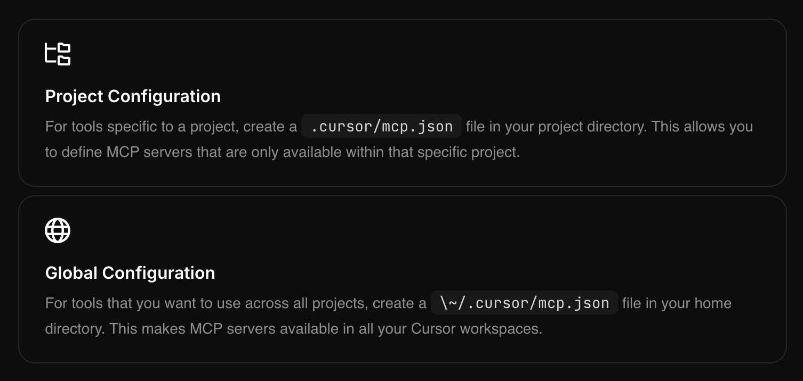

## MCP

### Project Configuration
For tools specific to a project, create a .cursor/mcp.json file in your project directory. This allows you to define MCP servers that are only available within that specific project.
### Global Configuration
For tools that you want to use across all projects, create a \~/.cursor/mcp.json file in your home
directory. This makes MCP servers available in all your Cursor workspaces.


Examples

* [servers/src/filesystem at main · modelcontextprotocol/servers](https://github.com/modelcontextprotocol/servers/tree/main/src/filesystem)
* [sqlite](https://github.com/modelcontextprotocol/servers/tree/main/src/sqlite)
* [servers/src/fetch at main · modelcontextprotocol/servers](https://github.com/modelcontextprotocol/servers/tree/main/src/fetch)
* [servers/src/sequentialthinking at main · modelcontextprotocol/servers](https://github.com/modelcontextprotocol/servers/tree/main/src/sequentialthinking)
* [varunneal/spotify-mcp: MCP to connect Claude with Spotify.](https://github.com/varunneal/spotify-mcp)
*


### Smithery
api key 5776d06b-957d-4149-9b44-212181dfd76c
#### Authentication[](https://smithery.ai/docs/registry#authentication)

All endpoints require authentication via a bearer token. You can create an API key by clicking on your login icon, and selecting API keys in the dropdown menu.

Include the following header in your API requests:

```typescript
headers: {
'Authorization': 'Bearer your-api-token'
}
```
#### List Servers[](https://smithery.ai/docs/registry#list-servers)

```http
GET https://registry.smithery.ai/servers
```
Retrieves a paginated list of all available servers.

##### Query Parameters

*   `q` (optional): Search query. We use semantic search, so treat this as a prompt.
*   `page` (optional): Page number for pagination (default: 1)
*   `pageSize` (optional): Number of items per page (default: 10)

##### Filtering

*   **Text Search**: Simply type any text to search semantically (e.g., `machine learning`)
*   **Owner Filter**: Use `owner:username` to filter by repository owner (e.g., `owner:smithery-ai`)
*   **Repository Filter**: Use `repo:repository-name` to filter by repository name (e.g., `repo:fetch`)
*   **Deployment Status**: Use `is:deployed` to show only deployed servers

You can combine multiple filters together. For example:
`owner:smithery-ai repo:fetch is:deployed machine learning`

**Response**

```typescript>
{
servers: Array<{
  qualifiedName: string;
  displayName: string;
  description: string;
  // Link to Smithery server page
  homepage: string;
  // Number of times the server has been used via tool calling
  useCount: string;
  // True if this server is deployed on Smithery as a WebSocket server
  isDeployed: boolean
  createdAt: string;
}>;
pagination: {
  currentPage: number;
  pageSize: number;
  totalPages: number;
  totalCount: number;
};
}
```
The response includes basic information about each server and pagination details to help you navigate through the list of servers.

### Get Server[](https://smithery.ai/docs/registry#get-server)

http

Copy

    GET https://registry.smithery.ai/servers/{qualifiedName}

Retrieves information about a specific server by its qualified name. The qualified name is a unique human-readable identifier for the server. You can find the qualified name from the server page's url: `https://smithery.ai/server/{qualifiedName}`.

#### Response

```typescript
{
    qualifiedName: string;
    displayName: string;
    deploymentUrl: string;
    connections: Array<{
      type: string;
      url?: string;
      configSchema: JSONSchema;
    }>;
 }
```

We will return you a response containing information about the server, including its qualified name, display name, and connection details.

The connection details specify how you can connect to this server.

*   `type`: The type of connection, such as "ws" for MCP served over WebSocket.
*   `url`: The URL to connect to.
*   `connections`: A list of possible ways to connect to the server.
    *   `type`: Either `stdio` or `ws` (websocket).
    *   `url`: The WebSocket URL to connect to, if applicable.
    *   `configSchema`: The JSON schema for the server's configuration. You must specify a config that complies with this schema in order to connect to this server. Some servers will have no configuration required.


### Connecting to WebSocket Servers[](https://smithery.ai/docs/registry#connecting-to-websocket-servers)

To connect to WebSocket servers, you have to format your URL as such:

`https://server.smithery.ai/${qualifiedName}/ws?config=${base64encode(config)}`

where `{url}` is the URL of the server served over WebSocket and `config` is the JSON configuration for the server that complies with the `configSchema` encoded in base64 format.


If you're using our [Typescript SDK](https://github.com/smithery-ai/typescript-sdk/), you can use the `createSmitheryUrl` function to produce the URL.

```typescript
import { WebSocketClientTransport } from "@modelcontextprotocol/sdk/client/websocket.js"
    import { createSmitheryUrl } from "@smithery/sdk/config.js"

    const url = createSmitheryUrl(
    "https://your-smithery-mcp-server/ws",
    {
      ...config goes here
    },
    )

    const transport = new WebSocketClientTransport(url)
```